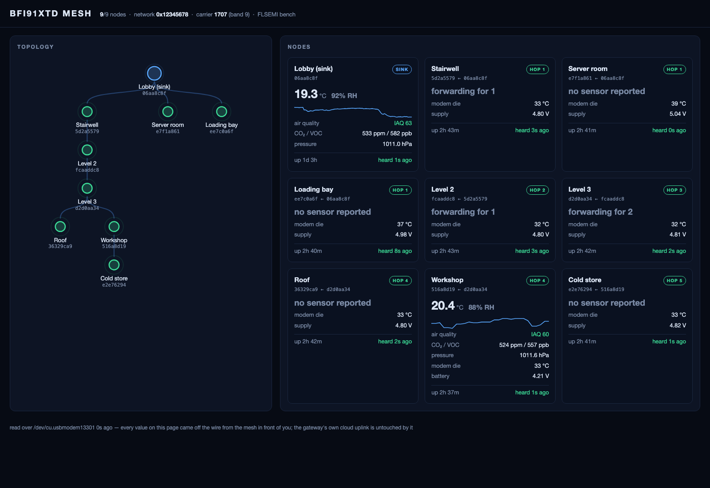
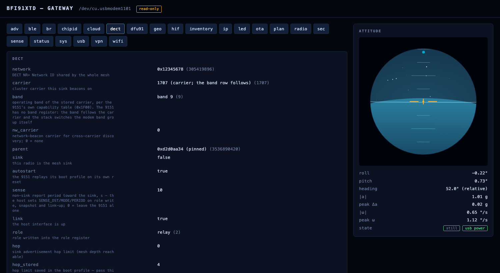

# flsemi-xtd

Local tools for the **FLSEMI BFi91XTD** DECT NR+ evaluation kit — a Nordic Thingy:91 X running FLSEMI's own DECT NR+ stack (BFi91NR7DLCVG on the nRF9151) and gateway firmware (BFi53USB7IP on the nRF5340).

Everything runs on the machine with the cable or the Bluetooth radio. Nothing here talks to any FLSEMI server: every value on screen came off the wire from the device in front of you.

**The kit is IPv6-only.** The gateway's Wi-Fi uplink, the ThingsBoard CoAP client, the WireGuard tunnel and the mesh border router all run on IPv6 (per TS 103 874-3); there is no IPv4 stack in the shipped image. Your Wi-Fi network needs router advertisements (SLAAC) and, for the cloud uplink, an IPv6 route out.

```
pip install flsemi-xtd          # or: uvx flsemi-xtd

xtd stage -d PORT               # local demo wall at http://127.0.0.1:8770 (read-only)
xtd ui -d PORT                  # local dashboard at http://127.0.0.1:8765 (read-only)
xtd ui -d PORT --allow-write    # ... with configuration writes enabled
xtd cfg -d PORT status          # role, carrier, association, uptime
xtd cfg -d PORT dect --help     # band / carrier / role / network ID
xtd cfg -d PORT dfu   gateway.bin   # nRF5340 firmware over USB (MCUboot image management)
xtd cfg -d PORT dfu91 stack.bin     # nRF9151 firmware through the gateway's serial-recovery proxy
xtd cfg -d PORT ota   stack.bin     # put an nRF9151 image in the sink's store — the mesh distributes it
xtd profile -d PORT dump -o before.json   # whole-device settings (secrets stay write-only)
xtd sh -d SHELLPORT 'hif r 0x0024 4'      # raw nRF9151 host-interface register access
```

Transport for every command: `-d /dev/cu.usbmodemXXXX1` (the SMP CDC port; `COMn` on Windows — `xtd cfg devices` lists what is attached) or `-d ble:<rd id>` once the device has opened its Bluetooth window (`ble --on` over USB, or a double press of Button 2). A gateway advertises as `BFi53-<rd id>`, and `-d ble:` matches any part of that, so the RD id alone is enough. Give the RD id rather than the whole name: firmware before 2026-09 advertised the gateway project's name, which is the same string on every board and so cannot tell two kits apart. `-d` may go before or after the subcommand. On macOS run from Terminal.app so the Bluetooth permission prompt can appear. `xtd sh` is the one command that uses the *second* CDC port (the diagnostic shell, `...XXXX3`).

## Licensing a unit

A unit runs the stack when it carries a licence signed over its own FICR device
id — which is unique per die and not writable, so a licence cannot be moved to
another unit. The device holds only a public key; nothing secret is shipped in
the hardware.

```
xtd licence -d PORT                      # what this unit carries
xtd licence -d PORT --request unit.json  # the request to send us (carries no secret)
xtd licence -d PORT --install unit.flic  # install what comes back
xtd licence --show unit.flic             # read a licence file, no device needed
```

The format is published in [doc/licence-format.md](doc/licence-format.md) — the
security is in the key, not in the structure. **The on-chip check is not
implemented yet**; until it is, `xtd licence` says so rather than implying a
unit is protected.

## Updating a kit from a published release

```
xtd update -d PORT              # the gateway's nRF5340
xtd update -d PORT --chip nrf9151 -n     # what would be installed, without installing it
```

`xtd update` reads what the kit is — the board image type it reports — fetches
the release manifest, takes only the artifact published for that board, checks
its SHA-256, and uploads it through the same paths `xtd cfg dfu` / `dfu91` use.
It installs nothing if the digest or the size disagrees with the manifest, and
it refuses rather than choosing when a release offers more than one candidate.

Published images are encrypted to a key that exists only in the kits we
supplied, and MCUboot decrypts them on-chip during the swap. This tool moves
bytes it cannot read, which is why a release can be public without being of use
on hardware that did not come from us. The design, and what is and is not
implemented today, is in [doc/firmware-distribution.md](doc/firmware-distribution.md)
— **no images are published yet.**

## The demo wall

`xtd stage` is a presentation view of a running mesh: the topology each node
reports (who it is attached to, how deep, when it was last heard) beside a live
card per node with its temperature, humidity, air quality and battery.



```
xtd stage -d /dev/cu.usbmodemXXXX1 --site "Building A" --names names.json
```

`names.json` gives the nodes the names the room knows them by, which is what a
visitor can read:

```json
{"06aa8c8f": "Lobby (sink)", "5d2a5579": "Stairwell", "e2e76294": "Cold store"}
```

One process owns the USB port and serves every browser pointed at it, so a
projector and a laptop show the same wall. **The gateway's ThingsBoard uplink
is unaffected**: it runs over the gateway's own Wi-Fi, not over this cable, so
the mesh can be on the cloud and on this wall at the same time — measured here
over 92 s of polling every 3 s, the gateway posted three more times and every
one was acknowledged. The wall has no write path at all: it cannot change the
thing it is demonstrating.

## Commands

| `xtd cfg ...` | Group 64 id | What it does |
|---|---|---|
| `status` | 0 | firmware version, SPI link to the nRF9151, USB audio, Wi-Fi association |
| `wifi` / `scan` / `ip` / `adv` | 1 / 2 / 11 / 12 | credentials and radio switch, site survey, the IPv6 address in use, power-save and country |
| `dect` | 3 | network id, carrier/band, parent pin, sink flag, autostart, report period, role, hop limit; `--apply`, `--snapshot` |
| `sec` | 5 | DECT NR+ MAC security: master key (write-only), `--require` |
| `usb` | 7 | USB Audio (UAC2) on/off |
| `dfu91` | 8 | nRF9151 image via the gateway's MCUboot serial-recovery proxy |
| `sys` | 9 | version/uptime; `--reset warm\|cold\|factory\|modem\|wifi\|wifi-creds\|modem-stack\|modem-factory` |
| `sense` | 15 | latest sample per node; `--temp-offset` |
| `cloud` | 16 | ThingsBoard CoAP uplink: host, port, token, interval, DTLS, per-node tokens (`--ntoken <rd id>:` with nothing after the colon removes one), proxy exclusions |
| `hif` | 17 | park the SPI host interface so another host can own the nRF9151 |
| `led` | 18 | air-quality indicator (LED2) and the nRF9151's LED1 |
| `radio` | 19 | MCS, TX power, chain mode, cluster-beacon period, scan timeout |
| `plan` | 20 | CDC site plan (TS 103 636-5 Annex C): read, `--raw`, `--lock`, apply from file |
| `br` | 21 | IPv6 border router prefix and enable |
| `vpn` | 22 | WireGuard tunnel parameters |
| `geo` | 23 | installation position and height (stored in the nRF9151) |
| `motion` | 24 | attitude from the on-board IMU and magnetometer |
| `chipid` | 25 | FICR device ids of both processors (licence binding) |
| `inventory` | 26 | every part on the board that can say who it is |
| `ota` | 27 | node image store: upload, `--clear`, `--client`, `--apply`, `--board` |
| `ble` | 28 | Bluetooth configuration window: `--on`, `--off`, `--unpair` |
| `dfu` | group 1 | this gateway's nRF5340: upload, `--test --reset`, `--confirm` |

Every id the gateway firmware serves (0.6.2) has a command here; the dashboard (`xtd ui`) exposes the same set as panels, one per URL fragment (`#dect`, `#cloud`, …), with every field annotated:



 `xtd profile dump/diff/restore` round-trips the settable subset of all of them, and `xtd profile site` snapshots the mesh as it is (plan, who is attached to whom, health).

## Verified on hardware

Run against two BFi91XTD kits on the bench (gateway firmware 0.6.2, stack Rev 1.513), one as the mesh sink and one as a leaf on it:

- Every read command on both kits; every write command on the leaf with read-back and restore.
- `dfu` (816 KB nRF5340 image, 36 s), `dfu91` (450 KB nRF9151 image over serial recovery, 80 s, the leaf back on the tree with its profile intact), `ota` (445 KB into the store at 16 KiB/s, sha256 matching).
- All eight `sys --reset` variants, including a 5340 factory reset followed by `profile restore`, and a 9151 `modem-factory` after which the gateway re-applied its stored profile and the leaf re-associated on its own.
- `xtd sh` register reads and writes against the nRF9151 map (`CHIP_ID`, `LONG_RD_ID`, `BOOT_COUNT`/`RESET_CAUSE`, the `GEO_*` block).
- The dashboard: every `/api/read/<subsystem>` route, a write, MCUboot slot listing, live attitude.
- The demo wall against a nine-node mesh five hops deep, with the cloud uplink running throughout.

Things the interface does not do, by design of the firmware rather than of this tool:

- The Wi-Fi PSK is write-only. `profile dump` carries the stored SSID (`cfg_ssid`, gateway 0.6.2 build 2026-09-21 or later; older builds only report the connected one) but a `restore` needs `--psk` typed in.
- `scan` on a gateway with no credentials brings the interface up for the survey and takes it down again afterwards (same build); older builds answer `EUNKNOWN` unless Wi-Fi is up.
- `geo` cannot yet be returned to "not set" through this interface: the stack (Rev 1.516) erases the record on a META write of 0, and the gateway's clear path for it is pending.
- `ip` is read-only and the dashboard hides the empty IPv4 fields the firmware still emits: addressing is SLAAC over Wi-Fi, so there is nothing to set.
- Group 64 ids 4, 6 and 10 are reserved (`ENOTSUP`); there is nothing to call.
- `dfu` with the image already running reports "same image as the one running; nothing to swap" instead of a test boot.

## What it talks to

| Path | Transport | Protocol |
|---|---|---|
| Gateway configuration plane | USB CDC-ACM #0 or BLE SMP GATT | SMP, custom group 64 (this tool) |
| Gateway firmware (nRF5340) | same | standard SMP image management — [nRF Connect Device Manager](https://www.nordicsemi.com/Products/Development-tools/nRF-Connect-Device-Manager) on a phone also works |
| Stack firmware (nRF9151) | same | group 64 `dfu91` (serial-recovery proxy) |
| Diagnostic shell | USB CDC-ACM #1 or BLE NUS | plain text, `hif r/w <addr> <n>` reads and writes the nRF9151 host-interface registers |

The full host-interface register map and the configuration command set are in the kit's documentation. This repository is the open half: how the host side speaks; the DECT NR+ stack itself is licensed separately.

## Regulatory note

The evaluation kit is supplied under 47 CFR §2.803(c)(2) for evaluation only and holds no FCC, RED or DECT NR+ certification. See the notice shipped with the kit.

## Licence

BSD-3-Clause. Copyright (c) 2026 BANFi Semiconductor Co., Ltd. and FL Semiconductor LLC.
Nordic Semiconductor, Thingy:91 X, nRF9151 and nRF5340 are trademarks of Nordic Semiconductor ASA.
